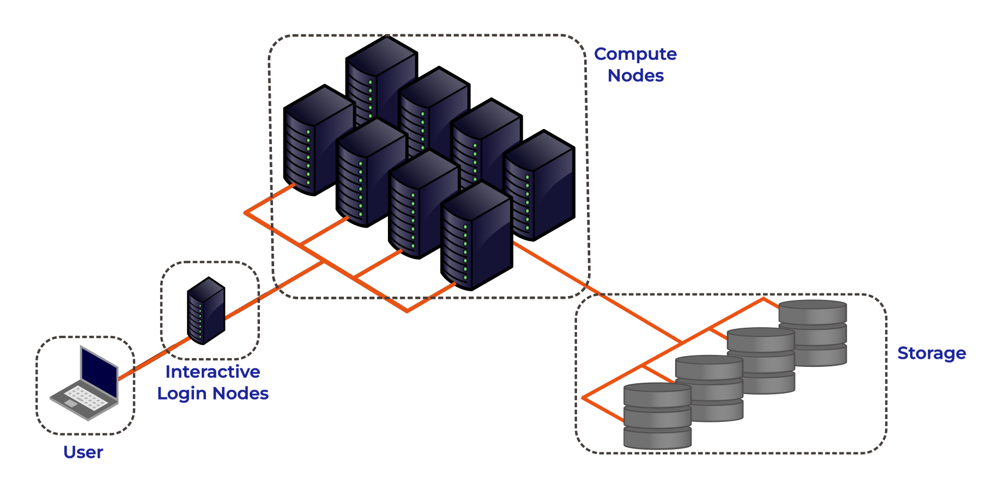

:::::::::::::::::::::::::::::::::::::: questions

- What is a High Performance Computing cluster?
- What is the difference between a HPC cluster and the cloud?
- How can I use a HPC cluster to do my research?
- What HPC clusters are available to me and how do I get access to them?

::::::::::::::::::::::::::::::::::::::::::::::::

::::::::::::::::::::::::::::::::::::: objectives

- Describe the purpose of an HPC system and what it does
- List the benefits of using an HPC system
- Identify how an HPC system could benefit you
- Summarise the typical arrangement of an HPC system's components
- Differentiate between characteristics and features of HPC and cloud-based systems
- Summarise the capabilities of the NOCS HPC facilities
- Summarise the key capabilities of IRIDIS5/6/X for NOCS applications
- Summarise key capabilities of national HPC resources and how to access them

::::::::::::::::::::::::::::::::::::::::::::::::

## High Performance Computing

{width="100%" .noinvert}

High Performace Computing (HPC) refers to the use of powerful computers and programming techniques to solve computationally intensive tasks. An HPC Cluster, or supercomputer, is one which harnesses the **aggregated** power of groups of advanced computing systems. These high performance computers are grouped together in a network as a unified system, hence the name cluster. HPC clusters provide extremely high computational capabilities, significantly surpasssing that of a general personal computer. 
 

:::::::: callout
Lets consider some computational research problems that could benefit from the aggregated computational power of High Performnace Computing:

- A oceanography research student is modelling ocean circulation by processing seismic reflection datasets. They have thousands of these datasets - but each processing run takes an hour. Running the model on a laptop will take over a month! In this research problem, final results are calculated after all 1000 models have run, but typically only one model is run at a time (in serial) on the laptop. Since each of the 1000 runs is independent of all others, and given enough computers, it’s theoretically possible to run them all at once (in parallel).

- The seismic reflection datasets are extremely large and the student is already finding it challenging to process the datasets on their computer. The researcher has just received datasets that are 10 times as large - analysing these larger datasets will certainly crash their computer. In this research problem, the calculations required might be impossible to parallelise, but a computer with more memory would be required to analyse the much larger future data set.

- An ocean modeller is using a numerical modelling system such as NEMO that supports parallel computation. While this option has not been used previously, moving from 2D to fully 3D ocean simulations has significantly increased the run time. In such models, calculations within each ocean subdomain are largely independent, allowing them to be solved simultaneously across processors while exchanging boundary information between adjacent regions. Because 3D simulations involve far more data and calculations, distributing the workload across multiple processors or computers connected via a shared network can substantially reduce runtime and make large-scale ocean simulations practical.
::::::::

HPC clusters fundamentally perform simple numerical computations, but on an extremely large scale. In our examples we can see where HPC clusters excel, using hundreds or thousands of processors to complete a numerical task that would take a desktop or laptop days, months or years to complete. They can also tackle problems that are too large or complex for a PC to fit in their memory, such as modelling the ocean dynamics or the Earth's climate. 

**High Performance Computing allows you as researchers to scale up your computational research and data processing, allowing you to do more research or to solve problems that would be infeasible to solve on your own computer.**

## HPC vs PC
Before we discuss High Performance Computing clusters in more detail let's start with a computational resource we are all familiar with, the PC:

### PC

<table style="width:100%; border-collapse:collapse; margin-bottom:1em;">
  <tr>
    <!-- Image column -->
    <td style="width:240px; vertical-align:top; text-align:center;">
      
    </td>

    <!-- Text column -->
    <td style="vertical-align:top; padding-left:20px;">
      
Your PC is your local computing resource, good for small computational tasks. It is flexible, easy to set-up and configure for new tasks, though it has limited computational resources.

      
Let’s dissect what resources programs running on a laptop require:

      <ul>
        <li>A keyboard and/or touchpad is used to tell the computer what to do (Input)</li>
        <li>The internal computing resources Central Processing Unit (CPU) and Memory are used to perform calculations</li>
        <li>Display depicts progress and results (Output); alternatively, both input and output can be done using data stored on Disk or on a Network</li>
      </ul>

    </td>
  </tr>
</table>

### If Our PC isnt Powerful Enough?

{width="20%"}

When the task to solve becomes too computationally heavy, the operations are typically out-sourced from your local laptop or desktop to elsewhere. 

Take for example the task to find the directions for your next conference. The capabilities of your laptop are typically not enough to calculate that route in real time, so you use a website, which in turn runs on a computer that is almost always a machine that is not in the same room as you are. Such a remote machine is generically called a server.

The internet made it possible for these data centers to be far remote from your laptop. The server itself has no direct display or input methods attached to it. But most importantly, it has much more storage, memory and compute capacity than your laptop will ever have. However, you still need a local device (laptop, workstation, mobile phone or tablet) to interact with this remote machine. 

There is a direct parallel between this and running computational workloads on HPC clusters, in that you outsource computational tasks to a remote computer. 

However there is a distinct difference between the "cloud" and an HPC cluster. What people call the cloud is mostly a web-service where you can rent such servers by providing your credit card details and by clicking together the specs of a remote resource. The cloud is a generic term commonly used to refer to remote computing resources of any kind – that is, any computers that you use but are not right in front of you. Cloud can refer to machines serving websites, providing shared storage, providing webservices (such as e-mail or social media platforms), as well as more traditional “compute” resources. 

### HPC Cluster

If the computational task or analysis is too large or complex for a single server, larger agglomerations of servers are used. These HPC systems are known as **supercomputers** or described as **HPC clusters** as they are made up of a cluster of computers, or compute nodes. 

Distinct to the cloud, these clusters networked together share a common purpose and are used to solve tasks that might otherwise be too big for any one computer. Each individual compute node is typically a lot more powerful than any PC - i.e. more memory, many more and faster CPU cores. 
However you access HPC clusters remotely, through the internet. 

The figure below shows the basic architecture of an HPC cluster.

{width="80%"}

Lets go through each part of the figure:

#### Interactive Login Nodes

When you are given an account on an HPC cluster you will get some login credentials. For example on Iridis, the University's HPC cluster, these are your University username and password. Using these credentials you can remotely logon to of the interactive login nodes from your local PC over the internet. There may be several login nodes, to make sure that all the users are not trying to access one single machine at the same time.

Once you have logged onto the login node you can now run HPC workloads, or jobs, on the HPC cluster. **BUT you typically do not directly access the CPU/GPU cores that do the hard work**. Supercomputers typically operate in batch mode, where you submit your workload to a resource manager which places it in a queue (resource management and job submission will be discussed in more detail later). The login node is where you prepare and submit your HPC jobs to the queue to be run. 

The login nodes provides:

* Interactive access point to the HPC resources. 
* Transferring data onto/off the system.
* Compiling code and lightweight development tasks.
* Preparing and submitting HPC workload job scripts to the scehduler. 
* Running short lightweight scripts for setup or testing.
* **Not for heavy computation** — they have limited resources, so running heavy computation here will affect other users!

#### Compute Nodes

The compute nodes are the core of the system, and contain the system resources to execute user jobs. They contain the thousands of processing units and memory, working in parallel, to run the HPC workloads. They are connected to one another through a high speed interconnect, so that the communication time between the processors on seperate nodes impacts program run times as little as possible. 

An HPC system may be made up of different types of compute node, for example a typical HPC system may have:

* **Batch CPU Nodes**: standard, general purpose, batch CPU nodes for executing parallel workloads. ( Tens/Hundreds of CPUs per node. Moderate RAM - hundreds of GBs)
* **High-mem**: nodes with similar CPUs to the standard nodes, but large amounts of memory (TBs of memory)
* **GPU nodes**: containing accelerators for highly parallel workloads e.g. AI training and inference, image processing and dense linear algebra.
* **Interactive/Visualisation**: nodes allowing users to run computationally intensive tasks interactively, such as data visualisation. 

#### Storage

These nodes are equipped with large disk arrays to manage the vast amounts of data produced by HPC workloads. In most systems, multiple storage nodes and disk arrays are linked together to form a parallel file system, designed to handle the high input/output (I/O) demands of large-scale computations. Users do not access storage nodes directly; instead, their file systems are mounted on the login and compute nodes, allowing access to data across the cluster. 

### HPC vs PC

OK, now we have had a look at what makes up the basic components of a HPC cluster lets summarise the key features and differences between your personal computer and a HPC cluster. 

| **Feature**              | **Local PC**                                                                 | **HPC Cluster**                                                                                 |
|---------------------------|------------------------------------------------------------------------------|--------------------------------------------------------------------------------------------------|
| **Hardware**              | Single standalone computer                                                  | Many interconnected compute nodes forming one system                                            |
| **Processors (CPU)**       | Few cores (4–16 typical)                                                   | Many CPUs per node; hundreds or thousands of cores total across the cluster                                 |
| **Memory (RAM)**          | Limited (8–128 GB)                                                         | Large aggregated memory (hundreds GB – several TB)                                              |
| **GPU (Accelerators)**    | Typically one consumer or workstation GPU (e.g., NVIDIA RTX)                 | Typically can have multiple high-end GPUs on GPU nodes (e.g., NVIDIA A100/H100), designed for massive parallel workloads |
| **Storage**               | Local SSD/HDD; limited capacity                                            | Shared large capacity high-speed parallel file system, and local SSD on compute nodes                                    |
| **Networking**            | Standard Ethernet; used mainly for internet or file sharing                | High-speed interconnects for low-latency communication                  |
| **Maintenance**           | User-maintained                                                           | Admin-maintained; centrally monitored and secured                                               |
| **Storage Access**        | Local file access only                                                    | Shared network storage accessible to all nodes                                                  |
| **Typical Use Case**      | Small-scale data analysis, development, or prototyping                     | Large-scale simulations, data-intensive computing, ML/AI training                               |
| **User Interaction**      | Direct, interactive sessions                                               | Typically accessed through the command line; Batch jobs submitted to queue; limited interactive use                                          |

## The HPC Landscape

HPC facilities are divided into tiers, with larger HPC clusters being categorised in higher tiers. 

{width="80%"}

In the UK there are three tiers, with an additional highest tier for continental systems:

* Tier 3: Local single institution supercomputers aimed towards researchers at one institution. At the University of Southampton we have the Iridis HPC cluster. 
* Tier 2: Layer of HPC clusters that sit above the Tier 3, or University systems, and are larger or more sepcialised than most University systems. These are facilities that fill the gap between tier 3 and tier 1 facilities, and are an EPSRC initialive. 
* Tier 1: Nationally leading HPC clusters (ARCHER2 and Isambard-AI)
* Tier 0: European facilities with petaflop systems, and the best across a continent. The Partnership for Advanced Computing in Europe (PRACE) provides access to the 8 Tier-0 systems in Europe. 

## Tier 3: Local HPC Clusters

### Iridis 6 & Iridis X

The local tier 3 system at the University of Southampton is known as Iridis, which is comprised of two seperate clusters known as **Iridis 6** & and **Iridis X**. 

Iridis 6 is the University's CPU based HPC cluster, intended for running large parallel, multi-node, CPU based workloads. It comprised of 26,000+ AMD CPUs:

:::callout
**Iridis 6 Specification**

* 134 Standard Compute Nodes
    - Dual-socket AMD EPYC 9654 (2×96 cores) → 192 cores per node
    - 750 GB RAM (≈650 GB usable)
* 6 Compute Nodes (EPYC 9684X)
    - Dual-socket AMD EPYC 9684X (2×96 cores) → 192 cores per node
    - 650 GB usable memory per node
* 4 High-Memory Nodes
    - Dual-socket AMD EPYC 9654 (2×96 cores) → 192 cores per node
    - 3 TB RAM (≈2.85 TB usable)
* 3 Login Nodes
    - Dual-socket AMD EPYC 9334 (2×32 cores) → 64 cores per node
    - 64 GB RAM limit and 2 CPU per-user limit on login nodes

::: 

Iridis X an hetereogeneous GPU cluster encompassing the University's GPU offering:

::: callout
**Iridis X Specification**

* AMD mi300x: 1 node — 128 CPU, 8× MI300X (192 GB each), 2.3 TB RAM
* Nvidia H200: 
    - Quad h200: 4 nodes — 48 CPU, 4× H200 (141 GB each), 1.5 TB RAM per node
    - Dual h200: 2 nodes — 48 CPU, 2× H200 (141 GB each), 768 GB RAM per node
* Nvidia A100:
    - 12 nodes — 48 CPU (Intel Xeon Gold), 2× A100 (80 GB each), 4.5 TB RAM per node
    - 1 Maths Node (Can be scavenged when idle)
* Nvidia L40: 1 node — 48 CPU, 8× L40 (48 GB each), 768 GB RAM
* Nvidia L4: 2 nodes — 48 CPU, 8× L4 (24 GB each), 768 GB RAM per node
* CPU Only:
    - AMD Dual AMD EPYC 7452: : 74 nodes (64 CPU), 240 GB RAM per node
    - AMD Dual AMD EPYC 7502 Serial Partition : 16 nodes (64 CPU), 240 GB RAM per node

There is also departmental cluster within Iridis X, known as Swarm. It is for the use of the Electronics and Computer Science department, but it can be scavenged (i.e. used when idle). It contains:

* Nvidia A100: 5 nodes — 96 CPU, 4× A100 SXM (80 GB each), 900 GB RAM per node
* Nvidia H100: 2 nodes — 192 CPU, 8× H100 SXM (80 GB each), 1.9 TB RAM per node
 
:::

You can find out more details about the system from the <a href="https://sotonac.sharepoint.com/teams/HPCCommunityWiki">HPC Community Wiki</a>, and to get access to the system there is a <a href="https://sotonac.sharepoint.com/teams/HPCCommunityWiki/SitePages/Connecting-to-Iridis5.aspx"> short application form</a> to be filled in.

There is a team of HPC system adminstrators that look after Iridis, including supporting the installation and maintenence of the software you need. You can contact them through the <a href="https://teams.microsoft.com/l/team/19%3A18c8baa70f8540d78455babffe11ad9c%40thread.tacv2/conversations?groupId=a0a40f99-c620-425f-8c12-a1216cf64cce&tenantId=4a5378f9-29f4-4d3e-be89-669d03ada9d8"> HPC Community Teams</a>.

## Tier 2: Regional HPC Clusters

There are 9 EPSRC Tier 2 clusters in the UK. Access to the Tier 2 Facilities is free for academic researchers based in the UK, though getting on to any particular system may be dependent on your institution and the research you do. Typically getting compute time is through public access calls, such as the <a href=https://www.ukri.org/opportunity/access-to-high-performance-computing-facilities-autumn-2025/ >UKRI Access to High Performance Computing Facilities Call</a>. Which is a "funding" call to get computational support for projects across the entire UK Research and Innovation (UKRI) remit. Each system may have also other routes to gaining access, such as including resources of the facility in research grant proposals.

<table style="width:100%; border-collapse:collapse; margin-bottom:1em;">
  <tr>
    <td style="width:120px; text-align:center; vertical-align:middle;">
      
    </td>
    <td style="padding-left:12px; vertical-align:middle;">
      <strong><a href="https://www.epcc.ed.ac.uk/cirrus" target="_blank">Cirrus (EPCC)</a></strong> — EPSRC Tier-2 HPC with 10,080-core SGI/HPE ICE XA system plus 36 GPU nodes (each with 4× NVIDIA V100). Free or purchasable academic access; industry access available.
    </td>
  </tr>

  <tr>
    <td style="text-align:center; vertical-align:middle;">
      
    </td>
    <td style="padding-left:12px; vertical-align:middle;">
      <strong><a href="https://www.baskerville.ac.uk/" target="_blank">Baskerville (University of Birmingham & partners)</a></strong> — Tier-2 EPSRC facility with 52 Lenovo Neptune servers, each with twin Intel IceLake CPUs and 4× NVIDIA A100 GPUs. Access via EPSRC HPC calls or the consortium.
    </td>
  </tr>

  <tr>
    <td style="text-align:center; vertical-align:middle;">
      
    </td>
    <td style="padding-left:12px; vertical-align:middle;">
      <strong><a href="https://docs.isambard.ac.uk" target="_blank">Isambard 3 (GW4)</a></strong> — Tier-2 facility with a main cluster containing 384 NVIDIA Grace CPU Superchips, 72 cores per socket, along with MACS (Multi-Architecture Comparison System) containing multiple different examples of architecture for testing/benchmarking/development. Free for EPSRC-domain academics; purchasable and industry access available.
    </td>
  </tr>

  <tr>
    <td style="text-align:center; vertical-align:middle;">
      
    </td>
    <td style="padding-left:12px; vertical-align:middle;">
      <strong><a href="https://www.csd3.cam.ac.uk/" target="_blank">CSD3 (Cambridge)</a></strong> — Data-centric Tier-2 HPC for simulation and analysis, operated across multiple institutions. Access through EPSRC calls for academics and industry users.
    </td>
  </tr>

  <tr>
    <td style="text-align:center; vertical-align:middle;">
      
    </td>
    <td style="padding-left:12px; vertical-align:middle;">
      <strong><a href="https://sulis.ac.uk/" target="_blank">Sulis (HPC Midlands+)</a></strong> — Tier-2 HPC for ensemble and high-throughput workflows using containerisation for scalable computing. Access via EPSRC calls or the Midlands+ consortium.
    </td>
  </tr>

  <tr>
    <td style="text-align:center; vertical-align:middle;">
      
    </td>
    <td style="padding-left:12px; vertical-align:middle;">
      <strong><a href=https://www.jade.ac.uk/ target="_blank">Jade (Joint Academic Data Science Endeavour) </a></strong>  — EPSRC Tier-2 deep learning system built on NVIDIA DGX-1 with 8× Tesla P100 GPUs linked by NVLink. Free for EPSRC academics; paid and industry access available.
    </td>
  </tr>

  <tr>
    <td style="text-align:center; vertical-align:middle;">
      
    </td>
    <td style="padding-left:12px; vertical-align:middle;">
       <strong><a href=https://mmmhub.ac.uk/ target="_blank">MMM Hub (Materials and Molecular Modelling Hub) </a></strong>  — Tier-2 supercomputing facility for materials and molecular modelling, led by UCL with partners in the Thomas Young Centre and SES Consortium. Available UK-wide.
    </td>
  </tr>

  <tr>
    <td style="text-align:center; vertical-align:middle;">
      
    </td>
    <td style="padding-left:12px; vertical-align:middle;">
      <strong><a href=https://www.ni-hpc.ac.uk/ target="_blank">NI-HPC</a></strong> — “Kelvin2” Tier-2 cluster supporting neuroscience, chemistry, and precision medicine with 60×128-core AMD nodes, 4 hi-memory nodes, and 32× NVIDIA V100s. Fast-track access.
    </td>
  </tr>

  <tr>
    <td style="text-align:center; vertical-align:middle;">
      
    </td>
    <td style="padding-left:12px; vertical-align:middle;">
      <strong><a href=https://n8cir.org.uk/supporting-research/facilities/nice/ target="_blank">Bede at N8 CIR</a></strong> — EPSRC Tier-2 HPC with 32 IBM POWER9 nodes (each 4× NVIDIA V100 GPUs) plus 4 NVIDIA T4 nodes for AI inference. Access via EPSRC calls or N8 partner universities.
    </td>
  </tr>
</table>

## Tier 1: National HPC Systems

There are four National HPC facilities in the UK, each of which have different architecture and will be suitable for different computational research problems. 

<table style="width:100%; border-collapse:collapse; margin-bottom:1em;">
  <tr>
    <td style="width:120px; text-align:center; vertical-align:middle;">
      
    </td>
    <td style="padding-left:12px; vertical-align:middle;">
      <strong><a href="https://www.archer2.ac.uk/" target="_blank">ARCHER2</a></strong>  — the UK's national supercomputing service offers a capability resource for running very large parallel jobs. Based around an HPE Cray EX supercomputing system with an estimated peak performance of 28 PFLOP/s, the machine will have 5,860 compute nodes, each with dual AMD EPYC Zen2 (Rome) 64 core CPUs at 2.2GHz, giving 750,080 cores in total. The service includes a service desk staffed by HPC experts from EPCC with support from HPE Cray. Access is free at point of use for academic researchers working in the EPSRC and NERC domains. Users will also be able to purchase access at a variety of rates. 
    </td>
  </tr>
  <tr>
    <td style="text-align:center; vertical-align:middle;">
      
    </td>
    <td style="padding-left:12px; vertical-align:middle;">
      <strong><a href="https://www.dirac.ac.uk/" target="_blank">DiRAC</a></strong>  — HPC for particle physics and astronomy, comprising multiple architectures. Including: Data Intensive Cambridge - DIAC (746,496 GPU Cores), Data Intensive Leicester - DIAL (40,288 CPU cores), Extreme Scaling Edinburgh - ES (4,921,344 GPU Cores), Memory Intensive Durham - DI (80,240 CPU Cores with 731TB memory). Free for STFC-domain academics; purchasable and industry access available.
    </td>
  </tr>
    <tr>
    <td style="text-align:center; vertical-align:middle;">
      
    </td>
    <td style="padding-left:12px; vertical-align:middle;">
      <strong><a href="https://docs.isambard.ac.uk/specs/#system-specifications-isambard-ai-phase-1" target="_blank">Isamnbard AI</a></strong>  — As well as the Isambard 3 tier 2 system the GW4 also manages Isambard-AI: National AI Research Resource (AIRR), a tier 1 AI HPC system aimed at supporting AI and GPU enabled computational research. It is composed of 5448 GH200 Grace Hopper superchips containing one Grace CPU and one Hopper H100 GPU. It is ranked 11th in the TOP500 list of the fastest supercomputers in the world.
    </td>
  </tr>
    <tr>
    <td style="text-align:center; vertical-align:middle;">
      
    </td>
    <td style="padding-left:12px; vertical-align:middle;">
      <strong><a href="https://www.hpc.cam.ac.uk/d-w-n target=" target="_blank">Dawn</a></strong>  — The AI Research Resource (AIRR) also includes Dawn, a tier 1 AI HPC cluster aimed at supporting AI and GPU enabled computational research. The Cambridge Dawn facility is made up of 1,024 Intel Data Centre GPU Max 1550 GPUs.
    </td>
    </tr>
  </table>

Access to the National Facilities is through public access calls:

* ARCHER2: access for UK acadmeics is typically through the <a href=https://www.ukri.org/opportunity/access-to-high-performance-computing-facilities-autumn-2025/ >UKRI Access to High Performance Computing Facilities Call</a>. 
* AIRR (Isambard-AI & DAWN): access for UK academics is typically through the <a href="https://www.gov.uk/government/publications/ai-research-resource/airr-gateway-route-ukri-guidance">AIRR Gateway route</a>, offering up to 10,000 GPU hours, designed for researchers from academia, industry, or other UK organisations.
* DiRAC: access for UK academics is typically through the <a href="https://dirac.ac.uk/getting-access/">STFC’s Resource Allocation Committee</a> calls.

## Iridis On Demand

From your bash session this morning you will now be aware of the power the programmatic capabilities of a scripting language from the command line. User interaction with High Performance Computing clusters has typically always been done using the command line, and leveraging a scripting language from the command line can be extremely efficient when manipulating data and interacting with the cluster's resources. 

However there is an alternative for Iridis, the HPC cluster at the University of Southampton, which is Iridis On Demand. Iridis on Demand provides a web based interface to HPC system, allowing you to create job scripts, transfer data on/off the system, submit and manage jobs and even run some interactive apps on the compute nodes, such as Jupyter notebooks and remote desktops. 

{width="80%"}

::::::::::::::::::::::::::::::::::::: keypoints

- High Performance Computing (HPC) combines many powerful computers (nodes) into clusters that work together to solve large or complex computational problems faster than a personal computer.
- HPC is essential when problems are too big, data too large, or computations too slow for a single machine — for example, large-scale simulations, modelling, or machine learning training.
- HPC facilities in the UK are divided into tiers: the largest systems categorised in higher tiers. The University of Southampton's HPC system is a local tier 3 facility and you can get access to use it.
- Iridis On Demand: Provides a web interface to the Iridis cluster, enabling file management, job submission, and interactive applications (like Jupyter notebooks) without command-line use.

::::::::::::::::::::::::::::::::::::::::::::::::
