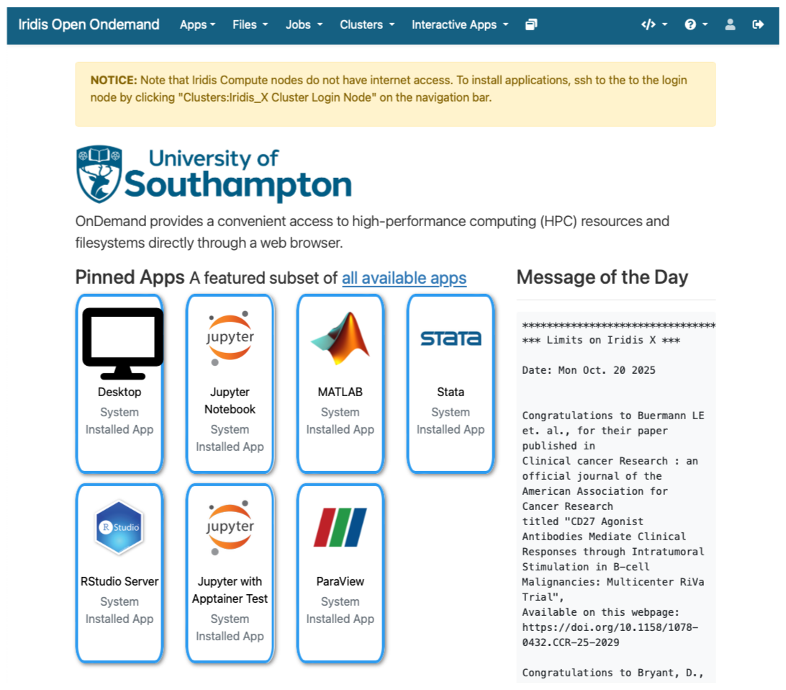

:::::::::::::::::::::::::::::::::::::: questions

- How do I get an account to access Iridis?
- How is my connection to an HPC system secured?
- How can I connect to an HPC system?
- What ways are there to get data on to and from an HPC system?
- How should I manage my data on an HPC system?
- What software is available on an HPC system, and how do I access it?

::::::::::::::::::::::::::::::::::::::::::::::::

::::::::::::::::::::::::::::::::::::: objectives

- Summarise the process for applying for access to Iridis & OpenOnDemand
- Summarise how access to HPC systems is typically secured
- Describe how to connect to an HPC system using an SSH client program
- Describe how to transfer files to and from an HPC system over an SSH connection
- Summarise best practices for managing generated research data
- Explain how to use software packages installed on the system through software modules

::::::::::::::::::::::::::::::::::::::::::::::::


We have seen a high level overview of _what_ an HPC system is, and why it could be enormously beneficial to your research. Now it is time to discuss _how_ we get access to it and look at the first steps of using an HPC system: logging on, transferring data,  accessing installed software and getting help!

## Getting access to an HPC system

An HPC system is an incredibly valuable resource, and getting access to one will involve a few steps. Prospective users will typically have to request an account through a sign-up process, along with a justification of the use of the system. For example this can be through a "funding" application for Computing Resources, as we have seen for Tier 2 and National HPC systems in the previous episode, or a much more straight-forward request to the HPC administration team of a local tier 3 HPC system. 

### Getting Access to Iridis

In the case of Iridis, the process of getting access to the system is straight forward. Use of the system is *free* at the point of use, and there is a <a href="https://sotonac.sharepoint.com/teams/HPCCommunityWiki/SitePages/Connecting-to-Iridis5.aspx"> short application form</a> to be filled in. 

The application includes a brief summary of the project you will be working on and the research topic along with some details of your computing requirements. Getting an account on Iridis 6 or Iridis X (or both) is through the same application form, and you can explicitly include which machine you would like an account for in the form. If you are unsure about which system would suit your needs best then there are plenty of avenues for getting help, which we will discuss later. Once your request has been granted the HPC team will contact you to let you know your account has been set-up, and you will be able to login to the system.

## Securely Connecting to an HPC System

Accessing an HPC system is most often done through the command line interface (CLI), the use of which you are already familiar with from your bash session this morning. The only leap to be made here is to open the CLI on a remote machine, though there are precautions to be taken to ensure the connection is secure. These precautions make sure no-one can see or change the commands you are sending and that no-one gets access to your account. 

These security requirements are most often handled through use of a tool known as **S**ecure **SH**ell (SSH). Logging onto your laptop or personal device will normally require a password or pattern to prevent unauthorised access. The likelihood of somebody else intercepting your password is low, since logging your keystrokes requires a malicious exploit or physical access. 

For systems running an SSH server anyone on the network can attempt to log in. Usernames are quite often public, or easy to guess, which makes the password the weakest link in the security chain. Many clusters therefore forbid password-based login, requiring instead that you generate and configure a public-private key pair with a much stronger password, known as SSH keys. 

While accessing Iridis can be done using your University username and password, we will quickly walk through the use of SSH keys and an SSH agent to both strengthen your security and make it more convenient to log in to remote systems.

### SSH Keys

SSH keys are an alternative method for authentication to obtain access to remote computing systems. They can also be used for authentication when transferring files or for accessing remote version control systems (such as GitHub). We will walk through the creation and use of a pair of SSH keys:

- a private key which you keep on your own computer, and
- a public key which can be placed on any remote system you will access.

:::callout
A private key that is visible to anyone but you should be considered compromised, and must be destroyed. This includes having improper permissions on the directory it (or a copy) is stored in, traversing any network that is not secure (encrypted), attachment on unencrypted email, and even displaying the key on your terminal window.
:::

The standard location for ssh keys is in a hidden folder in your home directory. Best to check if there are any there before creating a new pair, and potentially over writing the old ones! 

```bash
username@laptop:~$ ls ~/.ssh
id_ed25519 id_ed25519.pub
```

To generate a new pair of SSH keys we can use the `ssh-keygen` tool from the CLI. You can see the manual and all the arguments and options for the tool with the following command:

```bash
username@laptop:~$ man ssh-keygen
```
```output
SSH-KEYGEN(1)                                                                             General Commands Manual                                                                             SSH-KEYGEN(1)

NAME
     ssh-keygen – OpenSSH authentication key utility

SYNOPSIS
     ssh-keygen [-q] [-a rounds] [-b bits] [-C comment] [-f output_keyfile] [-m format] [-N new_passphrase] [-O option] [-t dsa | ecdsa | ecdsa-sk | ed25519 | ed25519-sk | rsa] [-w provider] [-Z cipher]
     ssh-keygen -p [-a rounds] [-f keyfile] [-m format] [-N new_passphrase] [-P old_passphrase] [-Z cipher]
     ssh-keygen -i [-f input_keyfile] [-m key_format]
     ssh-keygen -e [-f input_keyfile] [-m key_format]
     ssh-keygen -y [-f input_keyfile]
     ssh-keygen -c [-a rounds] [-C comment] [-f keyfile] [-P passphrase]
    ...
```

In order to create an SSH key pair we can use the following command:

```bash
username@laptop:~$ ssh-keygen -a 100 -f ~/.ssh/id_ed25519_iridis -t ed25519
```
This will generate a new strong SSH key pair, with the following flags:

- a (default is 16): number of rounds of passphrase derivation; increase to slow down brute force attacks.
- t (default is rsa): specify the “type” or cryptographic algorithm. ed25519 specifies EdDSA with a 256-bit key; it is faster than RSA with a comparable strength.
- f (default is /home/user/.ssh/id_algorithm): filename to store your private key. The public key filename will be identical, with a .pub extension added.

When prompted, enter a strong password:

:::callout
- Use a password manager and its built-in password generator with all character classes, 25 characters or longer, such as LastPass.
- Create a memorable passphrase with some punctuation and number-for-letter substitutions, 32 characters or longer. 
- **Nothing is less secure than a private key with no password.** If you skipped password entry by accident, go back and generate a new key pair with a strong password.
:::

Take a look in `~/.ssh` (use `ls ~/.ssh`). You should see two new files:

- your private key (~/.ssh/id_ed25519_iridis): do not share with anyone!
- the shareable public key (~/.ssh/id_ed25519_iridis.pub): if a system administrator asks for a key, this is the one to send. It is also safe to upload to websites such as GitHub: it is meant to be seen.


### SSH Agent

Typing out a complex password by hand every time you want to connect to the HPC system is tedious. You can use SSH Agent to make the process much more convenient. It is a helper program that keeps track of your keys and passphrases. It allows you to type your password once, and be remembered by the SSH Agent, for some period of time until you log off. 

We can check if the SSH agent is running with:

```bash
username@laptop:~$ ssh-add -l
```
If you get an error like:

```error
Error connecting to agent: No such file or directory
```

... then the agent needs to be started with:

```bash
username@laptop:~$ eval $(ssh-agent)
```

Now you can add your key to the agent with:

```bash
username@laptop:~$ ssh-add -t 8h ~/.ssh/id_ed25519_iridis
```
```output
Enter passphrase for .ssh/id_ed25519_iridis: 
Identity added: .ssh/id_ed25519_iridis
Lifetime set to 86400 seconds
```

Using an SSH Agent, you can type your password for the private key once, then have the agent remember it for some number of hours or until you log off. Unless someone has physical access to your machine, this keeps the password safe, and removes the tedium of entering the password multiple times.

### Logging on to the system

Logging onto an HPC system from the CLI is done with the `ssh` command. The general syntax of the command is:

```bash
ssh -i ~/.ssh/ssh_key your_username@hpc.system.address
```
The `-i` flag tells `ssh` to use an SSH key, and is followed by the path to its location. If using password authentication this flag can be omitted. 


The command to log onto Iridis 6 using the SSH key from the previous section would be:

```bash
username@laptop:~$ ssh -i ~/.ssh/id_ed25519_iridis your_university_username@iridis6.soton.ac.uk 
```
and for Iridis X there are 3 login nodes. `loginX001`; an Intel Xeon 8562Y+ login node with an NVIDIA L4 GPU, `loginX002` and AMD EPYC 7452 CPU node without a GPU, and `loginX003`; an AMD EPYC 9255 node with an NVIDIA L4 GPU. The commands to login to each of them are:

```bash
username@laptop:~$ ssh -i ~/.ssh/id_ed25519_iridis your_university_username@loginX001.iridis.soton.ac.uk  
username@laptop:~$ ssh -i ~/.ssh/id_ed25519_iridis your_university_username@loginX002.iridis.soton.ac.uk  
username@laptop:~$ ssh -i ~/.ssh/id_ed25519_iridis your_university_username@loginX003.iridis.soton.ac.uk  
```

**You must be on the University campus network, or using the VPN, in order to access Iridis.** You can read about how to access the VPN <a href="https://knowledgenow.soton.ac.uk/Articles/KB0011610"> here</a>. 

On successfully logging onto the system you will see a system message of the day similar to:
```bash
        ######################################################

                        WELCOME TO IRIDIS 6

        ######################################################


        Login nodes are limited to 64 GB of RAM and 2 CPUs per user.

        The system has two sets of hardware:

        134 Red Genoa nodes (red[6001-6134]):
                Dual socket AMD EPYC 9654 96-Core Processors = 192 cores
                650GB usable memory per node
                Single HDR 100 Gigabit IB connection

        6 Red Genoa-X nodes (red[6135-6140]):
                Dual socket AMD EPYC 9684X 96-Core Processors = 192 cores
                650GB usable memory per node
                Single HDR 100 Gigabit IB connection

        4 Gold nodes:
                Dual socket AMD EPYC 9654 96-Core Processors = 192 cores
                2.85TB usable memory per node
                Single HDR 100 Gigabit IB connection

        The system uses the Slurm scheduler, similar to Iridis 5, where the partitions
        are currently named red/gold after the hardware types. Please run 'sinfo' to
        get further information.

        Settings (such as Slurm flags, available modules, partition names, resource limits)
        on this system are likely to change over the next several weeks, please check
        your work matches the system prior to any usage.

        Users have a default limit of 384 CPUs, where we are looking to expand this
        during service and provide users up to 768 CPUs, based on experience level.

        For issues and problems, please contact us on Teams or via ServiceLine.
        There is now an Iridis 6 Support channel in Teams, please post in that
        channel.

        NB: There are no GPUs in Iridis 6 currently.
```
### Iridis On Demand

From your bash session this morning you will now be aware of the power of the programmatic capabilities of a scripting language from the command line. User interaction with High Performance Computing clusters has typically always been done using the command line, and leveraging a scripting language from the command line can be extremely efficient when manipulating data and interacting with the cluster's resources. 

However there is an alternative to SSH access from the command line for Iridis X, which is Iridis On Demand. Iridis on Demand provides a web based interface to HPC system, allowing you to create job scripts, transfer data on/off the system, submit and manage jobs and even run some interactive apps on the compute nodes, such as Jupyter notebooks and remote desktops. 

{width="80%"}

You can request access to Iridis on Demand through the same application form to obtain an account on the system:  <a href="https://sotonac.sharepoint.com/teams/HPCCommunityWiki/SitePages/Connecting-to-Iridis5.aspx#requesting-access-to-iridis-ondemand">application form</a>. Simply include `Iridis Ondemand` keywords in the comment section of the application. 

Once granted access you can login at https://iridisondemand.soton.ac.uk/, ensuring you are on the campus network, or using the VPN. 

## Data Transfer

Moving data onto and from an HPC system can be achieved in several ways. Two of the most common are SSH based protocols: SCP (Secure Copy) and SFTP (Secure File Transfer Protocol). 

### Using SCP in the terminal

To upload data from your local system to the remote HPC system you can use the scp command from the terminal. The general syntax to transfer a file is `scp /path/to/file.txt your_username@hpc.system.address:/path/to/directory`, so to transfer a file `important_data.mat` from your local system to the `data` folder in your home directory on Iridis 6 you would use the command

```bash
username@laptop:~$ scp /path/to/important_data.mat your_username@iridis6.soton.ac.uk:/home/username/data/
```
or to transfer an entire directory you would add the `-r` flag:

```bash
username@laptop:~$ scp -r /path/to/important_data/ your_username@iridis6.soton.ac.uk:/home/username/data/
```

To transfer from the host you simply reverse the order, e.g to copy a data folder from Iridis to your local home directory:

```bash
username@laptop:~$ scp -r your_username@iridis6.soton.ac.uk:/home/username/data/ ~/
```

`scp` is simple an lightweight, but is not able to resume a file transfer that has failed. 

### Using SFTP in the terminal

SCP is lightweight and extremely straightforward to use, however it is not very advanced in its abilities. SFTP has more advanced features, including: 

- Interactive sessions with remote file management such as renaming files, deleting files and directories and changing permissions and ownership. 
- Providing better recovery mechanisms, such as being able to restart transfers from an interruption.

To start an interactive SFTP session on Iridis 6 from the terminal we can use the command:
```bash
username@laptop:~$ sftp username@iridis6.soton.ac.uk
```
Once connected you can:

- list files:

    ```
    sftp> ls
    ```
- change directories:

    ```
    sftp> cd /path/to/remote/directory
    ```
- download a file:

    ```
    sftp> get remote_file.txt /local/destination/
    ```
- upload a file:

    ```
    sftp> put local_file.txt /remote/destination/
    ```

SFTP can also be used non-interactively to transfer files:
```bash
username@laptop:~$ sftp username@iridis6.soton.ac.uk:/home/username/my_file.txt /local/destination
```
### rsync
`rsync` is another versatile command line based tool for transferring data, it has a large number of options that allow for flexible specification of the files to be transferred. It has a delta-transfer algorithm, that compares modification times and sizes of files to synchronise between storage locations by copying only files that have changed and can allow restarting interrupted transfers. 

For example to transfer a file from your system to Iridis 6:

```bash
rsync -avzP /path/to/file.iso username@iridis6.soton.ac.uk:/path/to/directory/
```
where to option flags:
- `a` archive option used to preserve file timestamps and permissions
- `v` verbose option to monitor the transfer
- `z` compression option to compress the file during transfer
- `p` partial option to preserve partially transferred files in case of interruption 

To recursively copy a directory you could use the following command:

```bash
rsync -avzP /path/to/directory/ username@iridis6.soton.ac.uk:/path/to/directory/
```

### GUI based data transfer

There are GUI based alternatives to the above command line tools. One such option is <a href="https://filezilla-project.org/">Filezilla</a>, a cross-platform client MAcOS, Windows and Linux that can use the SFTP  protocol and will allow you to drag and drop files between the remote and local system.

Finally for Iridis X (and Iridis 6 as the two systems share a filesystem) Open on Demand has a file manager that will allow you to browse files as well as upload and download files to and from the system.

{width="80%"}

## Data Management

Computational research can produce large quantities of complex data, and good data management is extremely important for the integrity and reproducibility of your research. Having a good handle on data management when using an HPC system will make your life as a researcher easier; it will help you avoid data loss, will reduce storage waste and make it easier to for you to locate and analyse your data. 

Here are some suggestions for how to manage your data on an HPC system:

### Organise your Data: 
- Use clear directory structures, for example you could group by project, experiment, or date.
- Name files consistently: choose meaningful names that will help you identify what is in the file
- Use versioning tools such as git for code, scripts, configuration files and data.
- Include documentation such as README files and metadata alongside your data.

### Use the right filesystem:
- Most HPC clusters provide multiple storage filesystems optimised for different purposes. 
- For example, on Iridis 6 & X, your home directory (/home/username/) has a **110 GB quota** and is **regularly backed up**. This space is best used for storing important source code, scripts, and essential datasets needed to run your jobs. 
- You also have access to a scratch directory (**/scratch/username/**), which provides a much **larger 1.5 TB quota** but is **not backed up**. This area is designed for temporary or intermediate files — such as large simulation outputs or data requiring further analysis — that can be safely deleted or moved off the system once processing is complete.

### Data Lifecycle:
- Clean up old data to free up space: deleting or archiving with zipping tools.
- Track data provenance: Record how data was generated or modified.
- Back-up data: ensure important data is regulalry backed up off the HPC system.


## Software Management: Environment Modules

HPC systems will have a selection of centrally installed and managed software packages, but they will not be available to use immediately when you login. Software is usually managed on HPC systems using **Environment Modules**, and packages need to be _loaded_ before they are available for use. 

:::callout
There are several reasons behind the use of environment modules for software management. Can you think of any? Discuss it with your colleagues. 
:::
:::solution
The three main reasons behind this approach:

- Software incompatibilities: Software incompatibility is a major headache for programmers. Sometimes the presence (or absence) of a software package will break others that depend on it. Two well known examples are Python and C compiler versions. Python 3 famously provides a python command that conflicts with that provided by Python 2.
- Versioning: Software versioning is another common issue. A team might depend on a certain package version for their research project - if the software version was to change (for instance, if a package was updated), it might affect their results. Having access to multiple software versions allows a set of researchers to prevent software versioning issues from affecting their results.
- Dependencies: Dependencies are where a particular software package (or even a particular version) depends on having access to another software package (or even a particular version of another software package).
:::

Environment modules are the solution to these problems. A module is a self-contained description of a software package – it contains the settings required to run a software package and, usually, encodes required dependencies on other software packages.

There are a number of different environment module implementations commonly used on HPC systems: the two most common are TCL modules and Lmod. Both of these use similar syntax and the concepts are the same so learning to use one will allow you to use whichever is installed on the system you are using. In both implementations the module command is used to interact with environment modules. An additional subcommand is usually added to the command to specify what you want to do. For a list of subcommands you can use module -h or module help. As for all commands, you can access the full help on the man pages with man module.

On login you may start out with a default set of modules loaded or you may start out with an empty environment; this depends on the setup of the system you are using.

### Listing Loaded Modules
We can see what modules are loaded with the command:
```bash
[username@login6002 ~]$ module list
No modules loaded
```

### Listing Available Modules
In order to see what software modules are available we can use:
```bash
[username@login6002 ~]$ module avail
-------------------------------------------------------- /iridisfs/i6software/modules/applications --------------------------------------------------------
   GATK/4.1.9                      ansys/mechanical.2024.1        ensembl-vep/113              interproscan/5.71         paraview/5.10.1
   GATK/4.4.0                      ansys/mechanical.2024.2        fastq-tools/0.8.3            jdftx/1.7.0_gcc           paraview/5.12.1
   GATK/4.5.0                      ansys/mechanical.2025.1        fastqc/0.12.1                jdftx/1.7.0_mkl           paraview/5.13.3   (D)
   GATK/4.6.0                      ansys/mechanical.2025.2        ffmpeg/7.0.2                 jdftx/1.7.0        (D)    perl/5.40.0
   GATK/4.6.1                      ansys/polyflow.2024.2          gnuplot/6.0.1                julia/1.10.4              picard/3.3.0
   GATK/4.6.2               (D)    ansys/workbench.2024.2         gromacs/2022.5_plumed        julia/1.11.4              plink/1.9
   R/4.4.0-gcc8                    ansys/workbench.2025.1         gromacs/2024.1.dev1          julia/1.11.6              pycharm/2023.3.4
   R/4.4.1-mkl                     ansys/workbench.2025.2  (D)    gromacs/2024.1.amd           julia/1.11.7              python/3.12
   R/4.4.3-mkl                     bcl2fastq/2.20                 gromacs/2024.1.gcc           julia/1.12.1       (D)    python/3.12.6
   R/4.5.0-mkl                     bedtools/2.31.1                gromacs/2024.1.intel         lumerical/2024.2          python/3.13
   R/4.5.1-mkl              (D)    bionano/3.8.2                  gromacs/2024.1.zen4          lumerical/2025.1          python/3.14.0     (D)
   Rstudio/2024.09                 bison/3.8.2                    gromacs/2024.3.amd           lumerical/2025.2   (D)    samtools/1.20
   Rstudio/2024.12          (D)    blender/4.2.0                  gromacs/2024.3.intel         mathematica/14.0.0        silvaco/TCAD/2024
   Rstudio_server/2023.12.1        bwa-mem2/2.2.1                 gromacs/2024.5.amd           matlab/2024a              starccm/18.04
   Rstudio_server/2024.04.2 (D)    bwa/0.7.18                     gromacs/2024.5.intel         matlab/2024b       (D)    starccm/19.02
   STAR/2.7.11                     castep/25.1.2                  gromacs/2025.1.intel         namd/3.0.1                starccm/19.04
   abaqus/2024                     cfx/2025.1                     gromacs/2025.2.intel  (D)    nano/8.1                  starccm/19.06
   actran/2024.2                   comsol/6.1                     gurobi/11.0.3                nwchem/7.2.2_aocc         starccm/20.04     (D)
   ansys/fluent.2024.1             comsol/6.2_rev3                htslib/1.21                  nwchem/7.2.2_intel        stata/18.0
   ansys/fluent.2024.2             comsol/6.2                     hyperworks/2022.3            nwchem/7.2.2_ompi5        stata/19.0        (D)
   ansys/fluent.2025.1             comsol/6.3              (D)    hyperworks/2024.1            nwchem/7.2.2       (D)    tecplot/2023r1
   ansys/fluent.2025.2             csd/2024.1                     hyperworks/2025       (D)    onetep/7.2.intel          x13as/1.1
   ansys/forte.2024.1              datamash/1.3                   igv/2.19.1                   orca/6.1

--------------------------------------------------------- /iridisfs/i6software/modules/compilers ----------------------------------------------------------
   aocc/4.2             gcc/13.2.0    gcc/15.1.0        go/1.24.0                               intel-compilers/2024.1.0        nasm/2.16.03
   aocc/5.0      (D)    gcc/14.1.0    gcc/15.2.0 (D)    go/1.25.1                        (D)    intel-compilers/2025.0.0
   binutils/2.42        gcc/14.2.0    go/1.22.3         intel-compilers/2022.2.0.classic        intel-compilers/2025.1.0 (D)

----------------------------------------------------------- /iridisfs/i6software/modules/tools ------------------------------------------------------------
   apptainer/1.3.1    apptainer/1.4.2 (D)    cmake/3.30.5    cmake/4.1.1         (D)    gmsh/4.13.1        swig/4.3.0
   apptainer/1.3.6    awscli/v2              cmake/3.31.1    conda/python3              gocryptfs/2.5.4    valgrind/3.23.0
   apptainer/1.4.0    cmake/3.29.3           cmake/4.0.0     gdb-oneapi/2025.0.0        hpl/2.3

--------------------------------------------------------- /iridisfs/i6software/modules/libraries ----------------------------------------------------------
   aocl/4.2.0                  geos/3.13.0                     jdk/23.0.1                  openmpi/4.1.8                   sqlite3/3.46.1
   aocl/5.0.0                  gsl/2.8                         jdk/24                      openmpi/5.0.3_aocc              szip/2.1.1
   aocl/5.1.0_gcc14     (D)    guile/3.0.10                    jdk/25               (D)    openmpi/5.0.3_gcc13             tbb/2021.7.0
   boost/1.86.0                hdf5/1.14.5.classicintel        libfabric/1.22.0            openmpi/5.0.3_gcc14             tbb/2021.12
--More--
```
### Loading a Module
Say we have written a C program, that uses the MPI (Message Passing Interface) for parallel communication. Now we want to cmopile it with the `mpicc` compiler. We can see if the path to the `mpicc` compiler can be found in our shell with the `which` command (which shows the full path of shell commands):

```bash
[username@login6002 ~]$ which mpicc
/usr/bin/which: no mpicc in (/home/co1f23/.local/bin:/home/co1f23/bin:/opt/clmgr/sbin:/opt/clmgr/bin:/opt/sgi/sbin:/opt/sgi/bin:/usr/lpp/mmfs/bin:/usr/local/bin:/usr/bin:/usr/local/sbin:/usr/sbin:/iridisfs/i6software/slurm/default/bin:/iridisfs/i6software/slurm/bin:/opt/c3/bin)
```

The system looks through directories listed in our `$PATH` environment variable for the shell commands. The directories are listed following the `no mpicc in` message returned from the failed `which` command above. 

In order to load `openmpi`, a module containing `mpicc` we issue the following command:

```bash
[username@login6002 ~]$ module load openmpi 
```

Now when we use which to try and find the path to `mpicc` we get a different result:

```bash
[username@login6002 ~]$ which mpicc
/iridisfs/i6software/openmpi/5.0.6/aocc_5/bin/mpicc
```

`mpicc` is now found, and if we look at our `$PATH` environment variable we can see why:

```bash
[username@login6002 ~]$ echo $PATH
/iridisfs/i6software/openmpi/5.0.6/aocc_5/bin:/iridisfs/i6software/gcc/14.2.0/install/bin:/iridisfs/i6software/binutils/2.42/install/bin:/iridisfs/i6software/aocc/5.0/install/aocc-compiler-5.0.0/bin:/iridisfs/i6software/conda/miniconda-py3/condabin:/home/co1f23/.local/bin:/home/co1f23/bin:/opt/clmgr/sbin:/opt/clmgr/bin:/opt/sgi/sbin:/opt/sgi/bin:/usr/lpp/mmfs/bin:/usr/local/bin:/usr/bin:/usr/local/sbin:/usr/sbin:/iridisfs/i6software/slurm/default/bin:/iridisfs/i6software/slurm/bin:/opt/c3/bin
```

Several additions have been made to the list of directory paths the sytem will search to find the commands we issue, including the one that contains the `mpicc` command. 

So, issuing the `module load` command will add software to your `$PATH`. It “loads” software.

If we now look at the modules loaded we can see that the dependencies of the openmpi module have also been loaded:
```bash
[username@login6002 ~]$ module list
Currently Loaded Modules:
  1) aocc/5.0   2) binutils/2.42   3) gcc/14.2.0   4) openmpi/5.0.6_aocc
```
### Unloading Modules
In order to now unload the openmpi module we can use the command:
```bash
[username@login6002 ~]$ module unload openmpi
```
Now if we list the currently loaded modules:
```bash
[username@login6002 ~]$ module list
No modules loaded
``` 
we see that the openmpi module, along with its dependencies, have all been unloaded. 

### Purging Modules
Depending on the configuration of the modules on the HPC system, unloading a module may, or may not, also unload the dependencies. Another useful command to unload all loaded modules is the purge command:

```bash
[username@login6002 ~]$ module list
Currently Loaded Modules:
  1) aocc/5.0   2) binutils/2.42   3) gcc/14.2.0   4) openmpi/5.0.6_aocc
[username@login6002 ~]$ module purge
No modules loaded
```

## Getting Help

There are multiple avenues to getting help with Iridis. 

You can find out more details about the system from the <a href="https://sotonac.sharepoint.com/teams/HPCCommunityWiki">HPC Community Wiki</a>.

There is a team of HPC system adminstrators that look after Iridis, including supporting the installation and maintenence of the software you need. You can contact them through the <a href="https://teams.microsoft.com/l/team/19%3A18c8baa70f8540d78455babffe11ad9c%40thread.tacv2/conversations?groupId=a0a40f99-c620-425f-8c12-a1216cf64cce&tenantId=4a5378f9-29f4-4d3e-be89-669d03ada9d8"> HPC Community Teams</a>.

### Research Software Group & HPC Research Software Engineers
The <a href="https://rsgsoton.net/">Research Software Group</a> at Southampton is a team of Research Software Engineers (RSE) dedictaed to ensruing software developed for research is as good as it can be. We offer a full range of Software Development Services, covering many different technologies and all academic disciplines.

Within the Research Software Group there is a team of HPC RSEs who have been employed to help researchers make the best use of Iridis. Optimising or extending existing codes to make best use of the HPC resources available, e.g. refactoring, porting to HPC, porting to GPU. 

You can get in touch with the group by emailing rsg-info@soton.ac.uk.


::::::::::::::::::::::::::::::::::::: keypoints

- Access Iridis 6 and Iridis X requires applying for an account via a short online form, including project details and computing needs.

- Iridis On Demand provides a web-based interface for accessing the HPC system, managing files, submitting jobs, and running interactive applications like Jupyter notebooks.

- Connections to HPC systems are made securely using SSH (Secure Shell), typically through a public-private key pair for secure authentication.

- Data transfer to and from HPC systems can be done using SSH-based tools such as scp, sftp, or rsync, or through GUI tools like FileZilla or the Iridis On Demand.

- Software on HPC systems is managed using Environment Modules, which allow users to load, unload, and switch between software packages and versions.

- Help and documentation are available through the HPC Community Wiki, Teams HPC Community.

- There is a team of Research Software Engineers in the Research Software Group whose role is to help researchers port and optimise code for use on HPC systems.

::::::::::::::::::::::::::::::::::::::::::::::::
