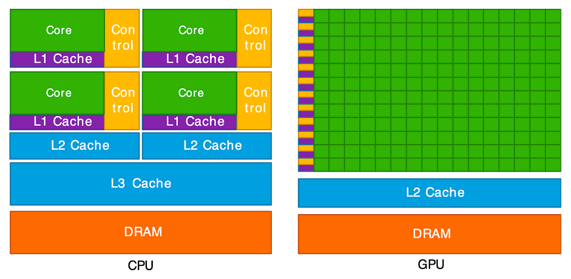

:::::::::::::::::::::::::::::::::::::: questions

- Which programming language should I use?
- What are the main ways we can parallelise a program on modern HPC systems?
- How do OpenMP and MPI differ in how they achieve parallelism?
- What role do GPUs play in HPC, and how do approaches like CUDA and OpenACC use them?

::::::::::::::::::::::::::::::::::::::::::::::::

::::::::::::::::::::::::::::::::::::: objectives

- Differentiate at a high level between the features of OpenMP, MPI, CUDA and OpenACC
- Briefly summarise the main OpenMP compiler directives and what they do
- Describe how to compile and run an OpenMP program
- Briefly summarise the main MPI message-passing features and how they are used
- Describe how to compile and run an MPI program
- Briefly summarise how an OpenACC program is written, compiled and run
- Briefly summarise how a CUDA program is written, compiled and run

::::::::::::::::::::::::::::::::::::::::::::::::

To get the most performance possible, high-performance computing relies on parallelism. Modern systems combines tens of
thousands of processors, each working on their own part of the problem. To be able to wield this power, we need to
understand how to write parallel code. This is far more complicated than the scope of this episode. Therefore we will,
instead, look at the landscape of the core HPC technologies used today in research. In particular, we will look at the
following parallel frameworks: OpenMP, MPI, OpenACC and CUDA.

## Common programming languages

Before we start, let's look at what programming languages are used in HPC. In principle, any programming language can be
used to write code which runs on an HPC cluster. In practise, however, there are some languages which are better suited
to writing highly performant code. Interpreted languages, such as [Python](https://www.python.org/), are easy to develop
in, but are much slower to execute than compiled languages, making them less suitable for computation-heavy
applications. For this reason, compiled languages such as [C](https://en.wikipedia.org/wiki/C_(programming_language)),
[C++](https://en.wikipedia.org/wiki/C%2B%2B) and [Fortran](https://fortran-lang.org/) are some of the most common
choices of programming language when writing high performance applications as they produce fast, optimised executables.

Python does, however, remain widely used in HPC, typically by performance-critical sections of code being written in
compiled languages and accessed through a Python interface. Frameworks such as
[PyTorch](https://pypi.org/project/torch/), [NumPy](https://pypi.org/project/numpy/),
[SciPy](https://pypi.org/project/scipy/) and [Numba](https://pypi.org/project/numba/) all rely on underlying C, Fortran
and/or CUDA to accelerate computation, while libraries such as [mpi4py](https://pypi.org/project/mpi4py/) or
[multiprocessing](https://docs.python.org/3/library/multiprocessing.html) make it possible for distributed parallelism
directly in Python. Hybrid approaches like this have become more common because they combine Python's ease of use with
the speed of compiled code.

Other specialised languages and frameworks are also used in HPC, depending on the application area.
[CUDA](https://developer.nvidia.com/cuda-toolkit) and [ROCm](https://www.amd.com/en/products/software/rocm.html) are
employed for GPU programming, while newer languages such as [Julia](https://julialang.org/) aim to combine ease of
development with high performance. Domain-specific tools like [MATLAB](https://www.mathworks.com/products/matlab.html),
and [R](https://www.r-project.org/) also appear in HPC environments, though they often rely on compiled extensions or
external libraries for parallel execution.

So which language should you use? There is no simple answer. The best choice depends heavily on your specific
application, the target hardware (like CPUs or GPUs), and the trade-offs you are willing to make between raw
computational performance and ease of development. Ultimately, the right language is the one that allows you to solve
your problem efficiently, leveraging the available libraries and expertise within your team.

::::::::::::::::::::::::::::::::::::: callout

### Which compiler should you use?

Iridis and most HPC systems offer a choice of compilers to use. But which one should you use? In most cases, you would
want to use the compiler specific to the type of CPU you are using on the system, because these implement architecture
specific optimisations e.g. use AMD's `aocc` on Iridis 6. If you are using NVIDIA GPUs, you have little choice in using
anything other than NVIDIA's `nvc`, `nvcc` or `nvfortran` compilers.

However, the code you are using may only have been tested on a specific compiler such as [GCC](https://gcc.gnu.org/). In
those cases, it's often best to stick with what is known to work. However, there is nothing stopping you using Intel's
compilers on an AMD based system, if the code is only tested or depends on features in the Intel compilers.

:::::::::::::::::::::::::::::::::::::::::::::

## A simple example

We'll now take a high level look at a selection of some of the most used libraries and frameworks used to parallelise
code in research. In particular, we will see how to use them, the code changes required and how to run them on Iridis.
The intention is not to make you proficient with these frameworks--or even dangerous--but to give a high level
appreciation on what is being used.

To illustrate this, we will use a simple program, written in C, which adds together two vectors to explore the code
changes required. More specifically, we will be modifying the following function `vector_add` to run in parallel. We have chosen
to use C here, as it is rather simple to look at and understand, but the language does not really matter.

```c
// *a, *b, and *c are arrays and n is the length of them.
// The result of the addition is returned back in *c
void vector_add(int *a, int *b, int *c, int n) {
    // This is the loop which we'll parallelise
    for (int i = 0; i < n; ++i) {
        c[i] = a[i] + b[i];
    }
}
```

You can find the entire program in [vector_serial.c](files/vector/vector_serial.c). To run this code on Iridis X, we'll
use the following [submission script](files/vector/submit_vector_serial.sh).

```bash
#!/bin/bash

#SBATCH --partition=amd
#SBATCH --nodes=1
#SBATCH --ntasks=1
#SBATCH --time=00:01:00

# Load the gcc module, which is the compiler we'll use
module load gcc

# Compile the program using gcc
gcc vector_serial.c -o vector_serial.exe

# Run the compiled executable
./vector_serial.exe
```

After the program has run, we should see the following output.

```output
Verification (first 5 elements):
c[0] =   0 (expected:   0)
c[1] =   3 (expected:   3)
c[2] =   6 (expected:   6)
c[3] =   9 (expected:   9)
c[4] =  12 (expected:  12)
```

## OpenMP

The first framework we'll look at is OpenMP. As mentioned in the previous episode, OpenMP is an industry-standard
framework designed for parallel programming in a shared-memory environment. OpenMP spawns threads with each one,
ideally, running on its own CPU core. OpenMP works by using *compiler directives* to tell the compiler which code needs
to be parallelised, letting OpenMP and the compiler take care of all the *low-level* parallelisation details. In
general, you just need to say which parts of your code you want to run in parallel.

::::::::::::::::::::::::::::::::::::: callout

### Compiler directives

If you're unfamiliar with compiler directives, you can think of them as being a *special command* for the compiler, not
for the program itself. In C and C++, these almost *always* start with `#pragma`. Think of it as a special note to the
compiler which says, "when you compile this specific piece of code, do something extra." Since these are compiler
options, they do not modify the run time behaviour of the program, only how the program is compiled.

:::::::::::::::::::::::::::::::::::::::::::::

Parallelisation with OpenMP is handled with these compiler directives. However, OpenMP does also offer a library of
runtime functions which gives finer grained control, such as if you need to ensure thread synchronisation or need to go
off the beaten track. To parallelise our `vector_add` function, we only need to add a single line of code, using a
compiler directive, just before the loop.

```c
void vector_add(int *a, int *b, int *c, int n) {
// This directive tells OpenMP to spawn threads and to
// divide the loop iterations between them. Each thread will
// handle a fraction of the loop iterations/vector addition
#pragma omp parallel for
    for (int i = 0; i < n; ++i) {
        c[i] = a[i] + b[i];
    }
}
```

The full program is in [vector_openmp.c](files/vector/vector_openmp.c). Let's break this down more. The directive we
used, `#pragma omp parallel for`, tells the compiler that the next for loop should be parallelised. The compiler then
automatically parallelises it for us, creating a team of threads and dividing the loop's work among them. In this case,
each thread will perform a portion of the vector addition. All OpenMP directives begin with `#pragma omp`, followed by a
specific command.

There are lots of other directives available, with `#pragma omp parallel for` being the most commonly used. Another
useful directive is `#pragma omp atomic` which prevents multiple threads from modifying a variable at once. This is one
way to prevent the race conditions mentioned in the previous episode. OpenMP also provides a library of runtime
functions which offers even more control. For example, we can use the function `omp_set_num_threads()` to control the
number of threads that OpenMP will spawn. In C, we need to include the appropriate header file, `<omp.h>`, to access
the library functions.

```c
#include <omp.h>

void vector_add(int *a, int *b, int *c, int n) {
    // Manually set the number of threads to 8
    omp_set_num_threads(8);

#pragma omp parallel for
    for (int i = 0; i < n; ++i) {
        c[i] = a[i] + b[i];
    }
}
```

::::::::::::::::::::::::::::::::::::: callout

### Directives and functions for synchronisation

Effective control of thread synchronisation is essential when parallelising code with OpenMP, as improper handling of
shared data can lead to race conditions and unpredictable results. To support this, OpenMP provides a range of
directives and library functions that coordinate access to shared data and manage thread behaviour. The tables below
summarise several commonly used examples.

| Compiler Directive     | Description                                                                                                                                   |
|------------------------|-----------------------------------------------------------------------------------------------------------------------------------------------|
| `#pragma omp atomic`   | Ensures a specific operation, such as modifying a variable, is executed atomically, e.g. by one thread at a time, to prevent race conditions. |
| `#pragma omp critical` | Defines a region of code that only one thread can execute at a time.                                                                          |

This list is not exhaustive. A complete reference for all OpenMP directives and functions is available in the [OpenMP
6.0 Reference Guide](https://www.openmp.org/wp-content/uploads/OpenMP-RefGuide-6.0-OMP60SC24-web.pdf).

:::::::::::::::::::::::::::::::::::::::::::::

To compile an OpenMP program, we need to use the `-fopenmp` flag, e.g. `gcc -fopenmp vector_openmp.c`. If we don't use
the `-fopenmp` flag, the compiler directives are ignored and any library functions from `<omp.h>` will not be found
resulting in a compilation error.

::::::::::::::::::::::::::::::::::::: callout

### Do I need to keep the serial version?

Setting the number of threads or processes to one will produce the same behaviour as the serial program, assuming no
programming errors. However, to be extra safe, you can use [conditional
compilation](https://en.wikipedia.org/wiki/Conditional_compilation) to maintain both parallel and serial versions within
the same codebase/file. Compiled languages support conditional compilation, which allows certain sections of code to be
compiled only if a specific condition is met. When using OpenMP, the compiler variable `_OPENMP` is defined when the
`-fopenmp` flag is passed, so you can use this variable to prevent OpenMP directives and functions from being compiled
when `-fopenmp` is not used.

:::::::::::::::::::::::::::::::::::::::::::::

To launch an OpenMP program, run it like any other program. The number of threads for OpenMP to use can be controlled
using the environment variable `OMP_NUM_THREADS`, or the `omp_set_num_threads()` function discussed earlier. If the
function is unused and the environment variable left unset, OpenMP will spawn one thread per CPU core. Normally,
on a HPC cluster this is probably what is wanted. However, when running on your own computer during development and
testing, you will probably want to set `OMP_NUM_THREADS` to be less than then number of CPU cores to avoid overloading
your computer.

The following is an example of how you would compile and launch an OpenMP program on Iridis X, in a single submission
script.

```bash
#!/bin/bash

#SBATCH --partition=amd
#SBATCH --nodes=1
#SBATCH --ntasks=1
#SBATCH --cpus-per-task=8
#SBATCH --time=00:01:00

# Use OMP_NUM_THREADS to say we can to use --cpus-per-task number of
# threads. The --cpu-per-task SBATCH directive is populated into the
# SLURM_CPUS_PER_TASK environment variable
export OMP_NUM_THREADS=$SLURM_CPUS_PER_TASK

# Compile the program using gcc
module load gcc
gcc -fopenmp vector_openmp.c -o vector_openmp.exe

# We run the compiled executable just like the serial version
./vector_openmp.exe
```

The main advantage of OpenMP is that it requires only minimal code modification to parallelise existing programs,
particularly when the main computational workload lies within loops. Beyond simple loop-level parallelism, parallelising
more complex program structures becomes more challenging, though this is true of most parallel frameworks. OpenMP still
provides a wide range of straightforward directives, making it easy to adapt serial code without needing to design the
program for parallel execution from the start. Its main limitation is that it uses a shared-memory model, which requires
careful management of thread synchronisation and restricts scalability to a single compute node.

## Message Passing Interface (MPI)

The Message Passing Interface (MPI) was designed to enable scientific applications to run on supercomputers and, as
such, has become the dominant distributed-memory parallelism framework in research. An MPI application creates many
processes each working on their own individual task. However, unlike shared-memory approaches, each MPI process--or
rank--has its own private memory space. Therefore to exchange data between these ranks, explicit communication has to
happen. This is where MPI comes in. It provides a set of library functions to configure a parallel environment and
exchange data within it. The *key concept* in MPI is message passing, which involves the explicit exchange of data
between processes. Processes can send messages to specific destinations, broadcast messages to all processes, or perform
collective operations where all processes participate.

To achieve parallelism, each process runs a copy of the same program as the other processes, but works on its own subset
of data, or does its own tasks. The processes communicate to exchange data and/or coordinate their next tasks. The power
of MPI is that the processes can run on different nodes, allowing MPI programs to scale well beyond a single machine.
Thankfully the complexity of having to spawn processes on different nodes and communicate over the network is hidden
away and controlled by MPI's library of functions and the HPC cluster's scheduler/resource manager, e.g. Slurm on
Iridis.

But there are some trade-offs with MPI. In terms of performance, communicating data takes time. If you have a method
which requires frequent communication or data dependencies, then you will spend more time exchanging data than doing
computation. It may instead be worth using a shared-memory framework like OpenMP. However the biggest trade-off, by far,
is that you need to design your application in mind for MPI parallelisation. Unlike OpenMP, it is not simple to retrofit
a serial program with MPI. For example, we need to make sure we program ourselves initialising the MPI library, track
process IDs, explicitly send and receive data, coordinate the processes so they do their own work, and so on. The table
below gives an idea of some of the MPI functions we need to use and their purpose.

| Function                | Description                                                                                                                |
|-------------------------|----------------------------------------------------------------------------------------------------------------------------|
| `MPI_Init`              | Initialises the MPI environment. Must be called before any other MPI calls.                                                |
| `MPI_Comm_size`         | Returns the total number of processes in the communicator.                                                                 |
| `MPI_Comm_rank`         | Returns the rank (ID) of the calling process.                                                                              |
| `MPI_Send` / `MPI_Recv` | Used for direct point-to-point communication between processes.                                                            |
| `MPI_Barrier`           | Used for synchronisation. A processes cannot continue past the barrier until all processes have reached it.                |
| `MPI_Finalize`          | Shuts down the MPI environment. Must be called before exiting the program, other wise background MPI tasks may not finish. |

This is only a tiny glimpse into the available MPI functions, and what you can do with MPI. In total, there are around
500 functions.

Let's now take a look at the code changes we need to parallelise the `add_vector` function using MPI. A detailed
description of the MPI library functions, and how to design an MPI program, is out of scope for this episode, and
lesson, so we won't go much into the details. From a high level, what we need to do is: 1) initialise the MPI
environment, 2) split the work between processes, 3) have each process do their work, and 4) communicate the results
back to one or more processes for the cycle to repeat. The example code below demonstrates this. Keep in your head that
each process is executes the **exact** same function, but will do something different based on its ID.

```c
//Include the MPI header file to access the MPI functions
#include <mpi.h>

void vector_add(int *a, int *b, int *c, int n) {
    // Initialise the MPI environment -- nothing will work if we
    // don't do this
    MPI_Init(NULL, NULL);

    // Get the rank (process ID) and total number of processes launched
    int rank, size;
    int root_rank = 0;
    MPI_Comm_rank(MPI_COMM_WORLD, &rank);
    MPI_Comm_size(MPI_COMM_WORLD, &size);

    // Determine next how many elements of the vector this process
    // will handle. We will create a "local" array which will store
    // the results of the vector addition for this process
    int n_local = n / size;
    int c_local[n_local];

    // Determine the subset of the vectors a and b this process
    // will be adding together. To do this, we use the ID of
    // the process and the number of elements each process
    // will be working on
    int start = rank * n_local;
    int stop = (rank + 1) * n_local;

    // Perform the local computation on each process
    for (int i = start; i < stop; i++) {
        c_local[i] = a[i] + b[i];
    }

    // We can use this MPI_Gather function to send the "partial" results
    // from each process back to the "root" process. Only the root process
    // will have the complete vector
    MPI_Gather(c_local, n_local, MPI_INT, c, n_local, MPI_INT,
               root_rank, MPI_COMM_WORLD);

    // Finalise the MPI environment
    MPI_Finalize();
}
```

The complete program is in [vector_mpi.c](files/vector/vector_mpi.c). As you can see, the code is much more involved and
complicated than the OpenMP example. Every process runs this same function, but works on a different part of the vector
addition. The function start by the process finding out its unique ID (its rank) and the total number of processes
(size). Using this information, it calculates which slice of the vectors `a` and `b` it is responsible for. After
performing the addition for its slice, it stores the answer in a local `c_local` array. That data is then aggregated and
communicated back to the root process into the array `c` by using `MPI_Gather`. This function is a communication
function and a bit of a shortcut. Behind the curtain it doing the `MPI_Send` and `MPI_Recv` for us, sending data from
each process back to our root process; which is the only process with the complete result.

::::::::::::::::::::::::::::::::::::: challenge

Why does only the "root" process have the final, complete, result?

:::::::::::::::::::::::: solution

It is because we used `MPI_Gather` to "gather" the results from each process back to the root process. There is no
communication to the other process, so only the root process has the data from the other processes. If we wanted every
process to have a copy of the final result of `c`, we could instead use `MPI_Allgather`.

:::::::::::::::::::::::::::::::::
::::::::::::::::::::::::::::::::::::::::::::::::

To compile an MPI application, we need to use an *MPI-aware* compiler which is essentially a clever script which knows
where MPI is installed on our system to make compilation easier. On Iridis, this is `mpicc`. We use `mpicc` as we would
any other compiler: `mpicc vector_mpi.c -o vector_mpi.exe`.

::::::::::::::::::::::::::::::::::::: callout

### What's an MPI-aware compiler?

An MPI-aware compiler is essentially a script which wraps around your regular compiler to provide the required header
files and libraries to the compiler to build an MPI application. In theory, we could find those headers and libraries
ourselves and pass them the compiler instead. However, in practise, this is not worth our time when `mpicc` already does
it for us.

:::::::::::::::::::::::::::::::::::::::::::::

To launch an MPI application we need to use `mpirun`, e.g. `mpirun vector_mpi.exe`. This is another script provided by
MPI which handles launching the parallel processes and setting up the parallel environment. If we run the program
without using `mpirun`, then only a single processes will start and will probably become "deadlocked" as the program
waits indefinitely for messages from other processes that were never sent. On Iridis, and other Slurm clusters, we
can alternatively use the Slurm launcher `srun` to do the same job. To summarise, the purposes of `srun` and `mpirun` is
to,

1. Read the environment to see how many processes to create (e.g., from `#SBATCH --ntasks=8`).
2. Launch that many copies of your executable.
3. Manage where these processes run. If you request resources across multiple nodes, the launcher (in coordination with
   Slurm) starts the processes on the correct machines and ensures they can all communicate with each other.

The following is an example of how you would compile and launch an MPI program on Iridis X.

```bash
#!/bin/bash

#SBATCH --partition=amd
#SBATCH --nodes=1
#SBATCH --ntasks=8
#SBATCH --cpus-per-task=1
#SBATCH --time=00:01:00

# Load the specific MPI library we want to use
# This makes the 'mpicc' and 'mpirun' commands available
module load openmpi

# Compile the code using the MPI compiler wrapper
mpicc vector_mpi.c -o vector_mpi.exe

# Launch the program using 'srun'. This is the recommended
# launcher on Slurm clusters. 'srun' automatically reads the
# SBATCH settings and launches 8 (from --ntasks) copies
# of our executable
srun ./vector_mpi.exe

# -----------------------------------------------------------
# An alternative way to launch the program
# 'mpirun' is the more traditional MPI launcher. Here, we
# must explicitly tell it how many processes (-np) to run
# We use the $SLURM_NTASKS variable (which Slurm sets to 8)
# to match our resource request
# mpirun -np $SLURM_NTASKS ./vector_mpi.exe
# -----------------------------------------------------------
```

::::::::::::::::::::::::::::::::::::: callout

### Hybrid MPI+OpenMP

MPI and OpenMP don’t have to be competing choices. They can be used together in a hybrid parallel model, where MPI
distributes work across nodes and OpenMP manages threads within each node. This combination allows applications to scale
beyond a single machine while using memory and CPU cores more efficiently.

Hybrid parallelism reduces data duplication between processes and improves load balancing through OpenMP’s flexible
scheduling. It also helps lower communication costs by keeping shared-memory operations local to a node.

The main drawbacks are added complexity and potential overheads from managing both models. Code becomes harder to write,
debug, and port between systems. Still, hybrid MPI+OpenMP programs are often the best solution for large-scale workloads
where pure MPI or OpenMP alone falls short.

:::::::::::::::::::::::::::::::::::::::::::::

::::::::::::::::::::::::::::::::::::: challenge

Why does using a hybrid MPI+OpenMP scheme reduce data duplication?

:::::::::::::::::::::::: solution

In a pure MPI application, you would run many separate processes on a single compute node (e.g., 64 processes on 64
cores). Each MPI process has its own private memory. If all 64 processes need to access the same 10GB input file, that
10GB of data must be loaded 64 times, once into each process's memory. This duplicates the data 64 times, using 640GB of
RAM on that node just for that one file.

In a hybrid MPI+OpenMP model, you may run only one MPI process on that node. That single process would then use OpenMP
to spawn 64 threads, one for each core. Because all OpenMP threads share the memory of their parent process, the 10GB
input file only needs to be loaded once. All 64 threads can access that single copy, reducing the memory footprint for
that data from 640GB to just 10GB.

:::::::::::::::::::::::::::::::::
::::::::::::::::::::::::::::::::::::::::::::::::

## Using GPUs instead of CPUs

Besides using multiple CPUs, we can also use Graphical Processing Units (GPUs) to do calculations in parallel. GPUs were
originally designed to speed up rendering to display images to a screen, a task that involves performing millions of
simple, repetitive calculations in parallel. Researchers soon realised this design was also perfect for many scientific
problems.

GPUs are highly parallel, built to perform thousands of operations at the same time. This makes them ideal for work that
can be split into many identical, independent tasks. While CPUs are designed to tackle complex tasks one after another,
GPUs are optimised for doing the exact same operation on large amounts of data simultaneously. This is perfect for
problems like matrix operations, where every element can be processed in the same way.

However, *offloading* work to a GPU is more complicated than parallelising using CPUs. The main reason is that the CPU
and the GPU have their own separate memory spaces. Data stored in the CPU's memory is not visible to the GPU, and
vice-versa. This setup is similar to the separate memory for each process in MPI application. Data must be copied from
the CPU's memory to the GPU's memory. This transfer step is slow compared to the speed of the calculations. Therefore,
efficient GPU programs must minimise data transfers, often by keeping data on the GPU as long as possible. While
optimising CPU code often focuses on reducing the total number of calculations, optimising GPU code is usually more
about reducing data transfers and organising data efficiently in the GPU's memory.

This level of detail is beyond the scope of this introduction. As before, we will only give a broad overview of two
popular frameworks: OpenACC and CUDA. You can think of these as being similar to OpenMP and MPI:

- OpenACC is like OpenMP: you can often add it to existing code, using compiler directives to automatically handle the
  parallelisation.
- CUDA is "similar" to MPI: it is a more complex framework that requires you to design your program around it.

::::::::::::::::::::::::::::::::::::: callout

### CPU and GPU, what's the difference?



This diagram illustrates the key difference between a CPU and a GPU. On the left, the CPU is shown with a few, large
"Cores" (green). Each core is complex, paired with significant "Control" logic (yellow) and large, fast memory caches
(purple and blue). This design makes each CPU core very "smart" and powerful, ideal for handling complex instructions
and varied tasks one after another.

On the right, the GPU has a completely different structure. It is composed of hundreds or even thousands of tiny, simple
cores (the large green grid). Notice how much less space is dedicated to "Control" logic and complex caches. This
architecture is not designed for complex, sequential tasks. Instead, it is a massive parallel workforce, built to
execute the same simple operation (like `c[i] = a[i] + b[i]`) at the same time across thousands of different pieces of
data. This "many-core" design is what allows it to perform thousands of operations concurrently.

GPUs also use a different memory model. Each GPU core can access the large global memory, which is shared across the
entire GPU. It is slower to read and write to this. To improve performance, groups of cores are organised into blocks
which shared a small, but very fast, memory area. This setup is similar to shared-memory parallelism on CPUs, where
threads cooperate through a common memory space. However, each GPU block’s shared memory is private to that block, much
like how separate processes in a distributed-memory model (such as MPI) each have their own memory and must explicitly
exchange data. Efficient GPU programs manage this hierarchy carefully, reusing shared memory to reduce costly access to
global memory.

:::::::::::::::::::::::::::::::::::::::::::::

## OpenACC

OpenACC is a framework for parallel programming on GPUs, both for NVIDIA and AMD GPUs; i.e. it is platform agnostic.
Just like OpenMP, it uses compiler directives to tell the compiler which parts of code should be executed in parallel
on a GPU. Also like OpenMP, the OpenACC runtime and compiler handles all of the parallelisation details such as
generating the parallel code, transferring data between the CPU and GPU and synchronising/managing GPU threads.

Whilst most of the heavy lifting for OpenACC is done with compiler directives, a runtime library is also available for
finer control over things such as selecting which GPU to use (if you are lucky enough to have more than one!), finer
grained data movement and synchronisation mechanisms. To parallelise our `vector_add` function to a GPU, we only need to
add a single line of code.

```c
void vector_add(int *a, int *b, int *c, int n) {
// This OpenACC directive tells the compiler to parallelise the
// following 'for' loop, running its iterations concurrently
// on the GPU
#pragma acc parallel loop
    for (int i = 0; i < n; ++i) {
        c[i] = a[i] + b[i];
    }
}
```

The full program is in [vector_openacc.c](files/vector/vector_openacc.c). The directive `#pragma acc parallel loop`
tells the compiler to parallelise the loop and execute it on the GPU. Each GPU core/thread performs part of the vector
addition. OpenACC also takes care of allocating memory on the GPU and transferring data from the CPU to GPU's memory. It
also copies the results back to the CPU when the loop is completed.

::::::::::::::::::::::::::::::::::::: callout

## Some other useful directives

As we've seen,`#pragma acc parallel loop` targets a single loop. OpenACC also provides the `#pragma acc kernels`
directive. This directive is meant to be put before a larger region of code, such as a complicated loop or multiple
loops. The compiler then analyses this entire region and automatically determines the best way to convert the code,
including any loops it finds, into parallel "kernels" of code to run on the GPU.

The main difference is that `#pragma acc parallel loop` is prescriptive: you are explicitly telling the compiler to
parallelise that one loop. In contrast, `#pragma acc kernels` is descriptive: you are telling the compiler "here is a
block of code to accelerate," giving it freedom to analyse the code and choose the most efficient way to parallelise and
run it.

Additionally, whilst OpenACC automatically manages data transfers between the GPU and CPU, more explicit data management
is possible using directives such as `#pragma acc data`, `copy`, `copyin`, and `copyout` for more control.

:::::::::::::::::::::::::::::::::::::::::::::

To compile an OpenACC program, we need a compiler that supports it. On Iridis X this is either GCC or one from NVIDIA's
compiler collection. With GCC we need to use the `-fopenacc` flag. However, when using NVIDIA's C compiler, `nvc`, the
flag is instead `-acc`, e.g. `nvc -acc vector_openacc.c`. Without the flag, the OpenACC directives are ignored and GPU
code is not generated.

The following is an example of how you would compile and launch an OpenACC program on Iridis X. It is especially
important that we remember to request a GPU using the `--gres=gpu:1` directive and select a partition where nodes have
GPUs.

```bash
#!/bin/bash

#SBATCH --partition=l4
#SBATCH --nodes=1
#SBATCH --ntasks=1
#SBATCH --cpus-per-task=1
#SBATCH --gres=gpu:1
#SBATCH --time=00:01:00

# Load the NVIDIA HPC SDK module, which provides OpenACC support
module load nvhpc

# Compile the program with GPU offloading enabled
nvc -acc vector_acc.c -o vector_acc.exe

# Check GPU availability and run the program
nvidia-smi
./vector_acc.exe
```

The main advantage of OpenACC, like OpenMP, is that it allows rapid GPU parallelisation with minimal code changes. It is
particularly useful for incrementally porting existing CPU applications to GPUs. However, compared to lower-level
frameworks like CUDA, it offers less fine-grained control over GPU execution and memory management. OpenACC is therefore
well suited for scientific and engineering applications where productivity are more important than maximal performance.

## CUDA

The final framework we will look at is CUDA, which is essentially a programming language created by NVIDIA to run
arbitrary code on NVIDIA GPUs. However, unlike OpenACC which uses compiler directives to automatically parallalise
sections of code, CUDA is an extension of the C/C++ language which gives you explicit *fine-grained* control over the
GPU. This is a much more powerful and performant approach, but also far more complex. You are no longer advising the
compiler; you are directly writing the code that will run on the GPU. Given this complexity, we will only examine the
key concepts at a very high level.

In CUDA, you write special functions called *kernels* that are executed on the GPU. In the later code example below, we
have two functions: `vector_add_kernel` and `vector_add`. The `vector_add_kernel` function is the code which runs on the
GPU. The `__global__` keyword tells the compiler that this function should be launched from the CPU but run on the GPU.
Inside this kernel, each thread calculates its own unique ID using special variables (like `blockIdx.x` and
`threadIdx.x`). This ID determines which element `i` of the vector `c` that specific thread will process. This is the
core mechanism for dividing the parallel work. You will also see an `if (i < n)` check in the kernel. This is a crucial
safety check. GPUs launch threads in fixed-size groups, so you often launch more threads than you have data (e.g.,
launching 1024 threads for a 1000-element array). This `if` statement simply tells the "extra" threads (1000, 1001,
etc.) to do nothing. Without it, they would try to access memory that doesn't exist, which could corrupt your data or
crash the program.

The original `vector_add` functions runs on the CPU and manages the GPU, controlling when the GPU kernel is launched. It
must now do all the work *manually* that OpenACC handled automatically:

1. Allocate Memory: `cudaMalloc` is used to allocate separate memory for the three vectors (`d_a`, `d_b`, `d_c`) *on
    the GPU's memory*. The `d_` prefix is a common convention to mean "device" memory.
2. Copy Data In: `cudaMemcpy` (with `cudaMemcpyHostToDevice`) is called to copy the input data from the CPU's `a`
    and `b` arrays to the GPU's `d_a` and `d_b` arrays. This is the explicit data transfer.
3. Launch Kernel: The `<<<grid, BLOCK_SIZE>>>` syntax is the CUDA-specific command to launch the kernel. This tells
    the GPU to launch a "grid" of "blocks," to execute the `vector_add_kernel` function.
4. Copy Data Out: After the kernel finishes, `cudaMemcpy` (with `cudaMemcpyDeviceToHost`) copies the result from the
    GPU's `d_c` array back to the CPU's `c` array.
5. Clean Up: `cudaFree` releases the memory on the GPU.

```c++
// This is the "kernel" - the code that runs on the GPU a.k.a. the device
__global__ void vector_add_kernel(int *a, int *b, int *c, int n) {
    // Calculate the unique ID for this thread
    int i = blockIdx.x * blockDim.x + threadIdx.x;

    // Ensure the thread ID is within the bounds of the array
    if (i < n) {
        c[i] = a[i] + b[i];
    }
}

// This is the "host" function - the code that runs on the CPU
void vector_add(int *a, int *b, int *c, int n) {
    // Pointers for the "device" (GPU) memory
    int *d_a, *d_b, *d_c;
    int size = n * sizeof(int);

    // 1. Allocate memory on the GPU
    cudaMalloc(&d_a, size);
    cudaMalloc(&d_b, size);
    cudaMalloc(&d_c, size);

    // 2. Copy input data from CPU (host) to GPU (device)
    cudaMemcpy(d_a, a, size, cudaMemcpyHostToDevice);
    cudaMemcpy(d_b, b, size, cudaMemcpyHostToDevice);

    // 3. Launch the kernel on the GPU
    int BLOCK_SIZE = 256;
    int grid = (n + BLOCK_SIZE - 1) / BLOCK_SIZE;
    vector_add_kernel<<<grid, BLOCK_SIZE>>>(d_a, d_b, d_c, n);

    // 4. Copy the result from GPU (device) back to CPU (host)
    cudaMemcpy(c, d_c, size, cudaMemcpyDeviceToHost);

    // 5. Free the memory on the GPU
    cudaFree(d_a);
    cudaFree(d_b);
    cudaFree(d_c);
}
```

The full program is in [vector_cuda.cu](files/vector/vector_cuda.cu). To compile CUDA code, we must use NVIDIA's `nvcc`
compiler. Note that this is different from the `nvc` compiler we used to build the OpenACC version of `vector_add`. The
`nvcc` compiler understands the CUDA-specific syntax used to define and launch kernels, e.g. `__global__` and
`<<<...>>>`. It separates out the GPU-specific and CPU-specific code, compiling the CPU code using a standard C++
compiler. CUDA files typically use the .cu extension.

To run a CUDA program, it is launched like any other program, as the mechanics to communicate and launch threads on the
GPU is handled inside the program itself. The submission script for a CUDA code is nearly identical to the OpenACC
script from before.

```bash
# !/bin.bash
# SBATCH --partition=a100
# SBATCH --nodes=1
# SBATCH --ntasks=1
# SBATCH --gres=gpu:1
# SBATCH --time=00:01:00

# Load the NVIDIA CUDA toolkit module
module load cuda

# Compile the program using nvcc
nvcc vector_cuda.cu -o vector_cuda.exe

# Run the executable (no special launcher needed)
./vector_cuda.exe
```

The main benefit of CUDA is the total control it provides, which often leads to the highest possible performance. The
main drawbacks are its complexity (requiring manual memory management and kernel writing) and vendor lock-in, as CUDA
code will only run on NVIDIA GPUs.

::::::::::::::::::::::::::::::::::::: keypoints

- Any language can be used for HPC, however, compiled languages like C, C++ and Fortran are typically used for
  performance-critical code. Python is often used on HPC using libraries which are built on compiled languages.
- OpenMP is a shared-memory model, using compiler directives (`#pragma omp`) to easily parallelise code (often loops) to
  run on the CPU cores of a single node.
- MPI is a distributed-memory model, using a library of functions (`MPI_Init`, `MPI_Send`, etc.) to manage explicit
  communication between processes. It is complex but can scale across many nodes.
- GPUs are "many-core" processors ideal for massive, simple, parallel tasks (like matrix maths). Using them requires
  copying data between the CPU (host) and GPU (device).
- OpenACC uses compiler directives (`#pragma acc`) to offload work to a GPU, automating parallelisation and data
  transfers.
- CUDA is a complex, explicit programming model for NVIDIA GPUs. It requires you to write "kernels" and manually manage
  memory (`cudaMalloc`, `cudaMemcpy`) but offers the highest control and performance.

::::::::::::::::::::::::::::::::::::::::::::::::
